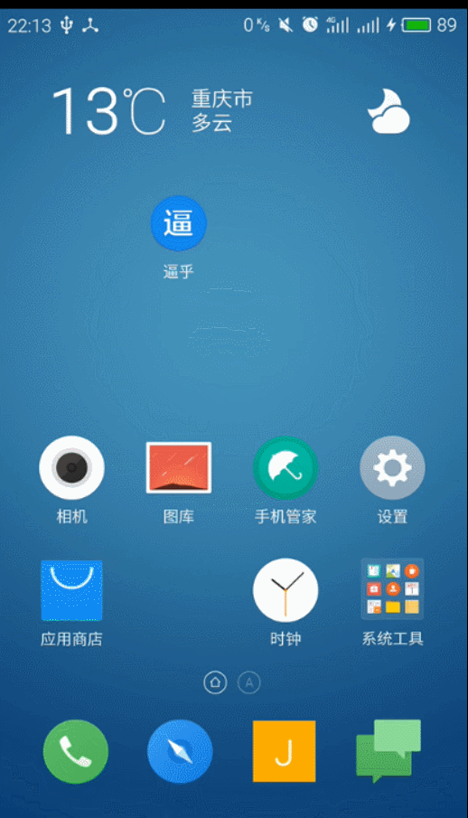
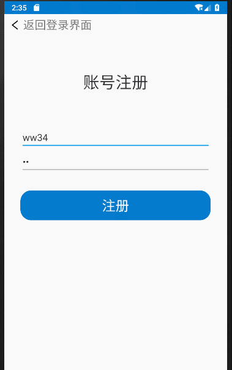
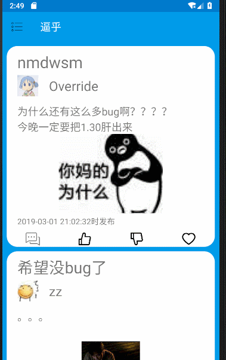
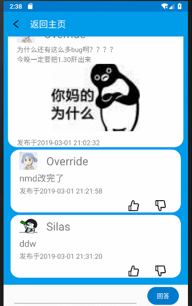

# 2019红岩移动开发部Android方向寒假考核

## 1.功能及操作方式

|欢迎|登录和注册|修改头像|
|---|---|---|
||||

|提交问题|修改密码|查看收藏|
|---|---|---|
||||

|回答点赞踩赞收藏|问题点赞踩赞收藏|查看回答|
|---|---|---|
||||

|发布回答|返回主页|退出登录|
|---|---|---|
||||

- 偷看的[hljj](https://github.com/Override0330)的表格形式，在这里感谢一下

- 最后两个强迫症就拿来凑数了 

## 2.对作品的描述/感受/体会

* 勉强算是实现了[逼乎api](https://github.com/jay68/bihu_web/wiki/逼乎API文档)的15个api

* 后端传回来的数据挺多没用上

* `NavigationView`上部的设置头像还有些问题

* 数据和图片没存在sd卡里

* 图片上传和下载时都没压缩

* 网络不好或者无网络时会出现很多奇异的操作

* ui丑

* 在快结束的时候知道了bean类

* 很多东西写的都不太合理

## 3.收获

* 加深了对`接口` `回调`以及`接口回调`的理解

* 学会了`布局的嵌套使用`

* 学会了简单的使用`POST请求`

* 加深了对`网络编程`和`多线程编程`的理解

* 懂得了简单使用一些之前从没接触过的控件，比如`NavigationView`,`DrawerLayout`,`SwipeRefreshLayout`,`ScrollView`

* 学会了写一些简单的工具类

* 明白了`成员变量` `静态变量`和`局部变量`的使用场景

* 使用`gradle`打包有签名的apk

## 4.安装包

点击传送门下载安装包，知道有很多不合理的地方，学长学姐们要是有issue可以给我提哦

上面要是翻车就点[这里](https://github.com/JAEFORIGHT/AndroidWinterVacationAssessment/release/BiHu_release_JAEFORIGHT.apk)吧

## 5.感谢

在最后感谢一下[子来学长的七牛token获取工具](https://github.com/Zzzia/qiniuToken)
